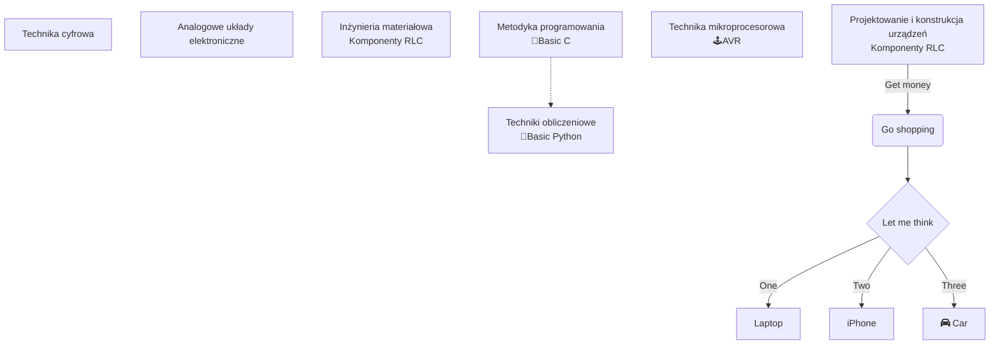

```mermaid
flowchart TD


  TC[Technika cyfrowa]

  A[Analogowe układy elektroniczne]

  RLC[Inżynieria materiałowa\nKomponenty RLC]

  C1[Metodyka programowania\n🐞Basic C]-.->
  PY1[Techniki obliczeniowe\n🐍Basic Python]

  C1TM[Technika mikroprocesorowa\n🕹️AVR]

  B[Techniki obliczeniowe\nBasic Python]

  PIK[Projektowanie i konstrukcja urządzeń\nKomponenty RLC]


    
    -->|Get money| B(Go shopping)
    B --> C{Let me think}
    C -->|One| D[Laptop]
    C -->|Two| E[iPhone]
    C -->|Three| F[fa:fa-car Car]
```